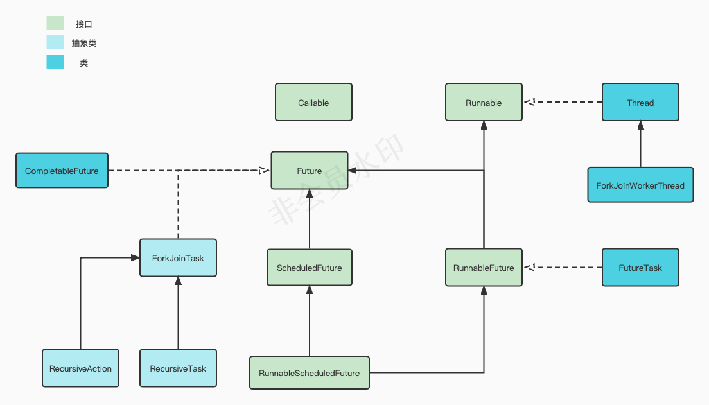

# Java多线程


## 一、概念

### 1.进程

一个进程包括由操作系统分配的内存空间，包含一个或多个线程。一个进程一直运行，直到所有的非守护线程都结束运行后才能结束。

### 2.线程

一个线程不能独立的存在，它必须是进程的一部分。 一条线程指的是进程中一个单一顺序的控制流，一个进程中可以并发多个线程，每条线程并行执行不同的任务。多线程是多任务的一种特别的形式，但多线程使用了更小的资源开销。多线程能满足程序员编写高效率的程序来达到充分利用 CPU 的目的。

### 3.并发与并行

指同一个时间段内多个任务同时都在执行，并且都没有执行结束。并发任务强调在一个时间段内同时执行，而一个时间段由多个单位时间累积而成，所以说并发的多个任务在单位时间内不一定同时在执行 。

并行是说在单位时间内多个任务同时在执行 。在多线程编程实践中，线程的个数往往多于CPU的个数，所以一般都称多线程并发编程而不是多线程并行编程。

### 4.线程同步

当有一个线程在对某个资源进行操作时，其他线程都不可以对该资源进行操作，直到该线程操作完成， 其他线程才能对该资源进行操作，在该线程操作完成前其他线程处于等待状态，即多个线程需要排队访问该共享资源。Java中提供synchronized关键字来实现同步锁。

### 5.线程死锁

死锁是指两个或两个以上的进程（线程）在执行过程中，由于竞争资源或者由于彼此通信而造成的一种阻塞的现象，若无外力作用，它们都将无法推进下去。此时称系统处于死锁状态或系统产生了死锁，这些永远在互相等待的进程（线程）称为死锁进程（线程）。多个线程同时被阻塞，它们中的一个或者全部都在等待某个资源被释放。由于线程被无限期地阻塞，因此程序不可能正常终止。

### 6.锁的种类

* 悲观锁/乐观锁

  是否一定要锁。悲观锁就是每次进行操作都会进行锁上，操作完以后才会解锁，当一个线程在执行的时候，其他线程都处于等待阻塞状态。乐观锁则是线程在执行的时候不会将要处理的资源锁上，会将资源复制一份，然后再复制的资源上进行操作，操作完以后提交到原有的数据上进行更新操作。但是在提交的时候，要进行比对判断，判断复制的原内容和现在的情况是否相同。例如：CAS，通过自旋来抵消阻塞，并不会真正的加锁而是通过代码编程的方式来解决线程同步问题。

* 共享锁/独占锁（排他锁）

  是否可以有多个线程同时拿锁。独占锁是一种悲观保守的加锁策略，它避免了读/读冲突，如果某个只读线程获取锁，则其他读线程都只能等待，这种情况下就限制了不必要的并发性，因为读操作并不会影响数据的一致性。 共享锁则允许多个线程同时获取锁，并发访问 共享资源，如：ReadWriteLock。 共享锁则是一种乐观锁，它放宽了加锁策略，允许多个执行读操作的线程同时访问共享资源。

* 公平锁/非公平锁

  是否按阻塞顺序拿锁。使用非公平锁，当前线程发现有空就会去使用，不会考虑其他线程，如果占用失败，则会采用类似公平锁的方式，到队列后面。效率高，但可能会造成单个线程做完了所有事，其他线程没事可干，一直陪跑。synchronized是非公平锁，lock默认是非公平，但是可以设置为公平锁 new reentrant(true)。使用公平锁，当前线程发现有空的时候，会询问其他线程是否有线程要使用，如果没有其他线程要使用，就自己用，如果有其他线程用，就排队。按照申请锁的顺序来执行，效率相对于非公平锁会低，因为会有询问的过程，但是相对非公平锁来说，每一个线程都有执行的机会，不会出现单线程干完所有事的情况（线程饥饿问题）。

* 可重入锁/不可重入锁

  拿锁线程是否可以多次拿锁。synchronized（隐式的上锁和解锁交给JVM）和Lock（显式的上锁和解锁交给用户本身）都是可重入锁。可重入锁又称为递归锁，当一把锁内部还有其他锁的时候，此时线程如果获得最外层的锁，那么内部的锁线程也可以随意进入。
  
* 自旋锁/互斥锁

  休眠等待还是自旋等待。**互斥锁**就是多个线程并发竞争锁的时候，没有抢到锁的线程会进入休眠状态即**sleep-waiting**，当锁被释放的时候，处于休眠状态的一个线程会再次获取到锁。缺点就是这一些列过程需要线程切换，需要执行很多CPU指令，同样需要时间。如果CPU执行线程切换的时间比锁占用的时间还长，那么可能还不如使用自旋锁。因此互斥锁适用于锁占用时间长的场合。**自旋锁**说白了也是一种互斥锁，只不过没有抢到锁的线程会一直自旋等待锁的释放，处于**busy-waiting**的状态，此时等待锁的线程不会进入休眠状态，而是一直忙等待浪费CPU周期。因此自旋锁适用于锁占用时间短的场合。
  
  

### 7.原子性

假设A有10块钱B有块钱，A给B转账1块钱，转账成功后应该是A还有9块钱B有10块钱；但是如果失败了呢？那么A就还是10块钱，B就还是9块钱。我们把这种要么一起成功，要么一起失败的操作叫原子性操作。如果把一个事务可看作是一个程序,它要么完整的被执行,要么完全不执行。这种特性就叫原子性。

### 8.CAS（Compare and Swap）

CAS是一种无锁算法，CAS有3个操作数，内存值V，旧的预期值A，要修改的新值B。当且仅当预期值A和内存值V相同时，将内存值V修改为B，否则什么都不做。CAS比较与交换的伪代码可以表示为：

```java
do{  
    备份旧数据； 
    基于旧数据构造新数据； 
}while(!CAS( 内存地址，备份的旧数据，新数据 ))  //一直到数修改成功
```


## 二、多线程并发常见问题

### 1.线程安全问题

多个线程同时操作同一个共享变量时，会出现一个线程更新共享变量的值，但是其他线程获取到的是共享变量没有被更新之前的值。就会导致数据不准确问题。

### 2.共享内存不可见性问题

Java 内存模型规定，将所有的变量都存放在主内存中，当线程使用变量时，会把主内存里面的变量复制到自己的工作空间或者叫作工作内存，线程读写变量时操作的是自己工作内存中的变量 。如图中所示是一个双核 CPU 系统架构，每个核有自己的控制器和运算器，其中控制器包含一组寄存器和操作控制器，运算器执行算术逻辅运算。CPU的每个核都有自己的一级缓存，在有些架构里面还有一个所有CPU都共享的二级缓存。 那么Java内存模型里面的工作内存，就对应这里的 Ll或者 L2 缓存或者 CPU 的寄存器

1、线程A首先获取共享变量X的值，由于两级Cache都没有命中，所以加载主内存中X的值，假如为0。然后把X=0的值缓存到两级缓存，线程A修改X的值为1,然后将其写入两级Cache，并且刷新到主内存。线程A操作完毕后，线程A所在的CPU的两级Cache内和主内存里面的X的值都是1。

2、线程B获取X的值，首先一级缓存没有命中，然后看二级缓存，二级缓存命中了，所以返回X=1；到这里一切都是正常的，因为这时候主内存中也是X=1。然后线程B修改X的值为2，并将其存放到线程2所在的一级Cache和共享二级Cache中，最后更新主内存中X的值为2，到这里一切都是好的。

3、线程A这次又需要修改X的值，获取时一级缓存命中，并且X=l这里问题就出现了，明明线程B已经把X的值修改为2，为何线程A获取的还是l呢？这就是共享变量的内存不可见问题，也就是线程B写入的值对线程A不可见。


## 三、Java多线程具体实现

### 1.创建线程

Java 提供了三种创建线程的方法。实现Runnable接口、继承Thread类和实现Callable接口。其中Callable接口是带返值的，返回值由Future的实现类封装通过调用get()方法获得。相关类继承关系如下图所示：



#### 通过实现 Runnable 接口

* 需要实现run()方法
* 使用Thread.currentThread（）方法获取当前线程对象
* 接口支持多实现
* 线程任务和业务逻辑代码分离
* 只能使用主线程里面被声明为final的变量

```java
class RunnableDemo implements Runnable {
   private Thread t;
   private String threadName;
   
   RunnableDemo( String name) {
      threadName = name;
      System.out.println("Creating " +  threadName );
   }
   
   public void run() {
      System.out.println("Running " +  threadName );
      try {
         for(int i = 4; i > 0; i--) {
            System.out.println("Thread: " + threadName + ", " + i);
            // 让线程睡眠一会
            Thread.sleep(50);
         }
      }catch (InterruptedException e) {
         System.out.println("Thread " +  threadName + " interrupted.");
      }
      System.out.println("Thread " +  threadName + " exiting.");
   }
   
   public void start () {
      System.out.println("Starting " +  threadName );
      if (t == null) {
         t = new Thread (this, threadName);
         t.start ();
      }
   }
}
 
public class TestThread {
 
   public static void main(String args[]) {
      RunnableDemo R1 = new RunnableDemo( "Thread-1");
      R1.start();
      
      RunnableDemo R2 = new RunnableDemo( "Thread-2");
      R2.start();
   }   
}
```


#### 通过继承 Thread 类

* 需要重写run方法
* 获取当前线程直接使用this就可以了，无须使用Thread.currentThread（）方法
* 不支持多继承，如果继承了Thread类，那么就不能再继承其他类。
* 线程任务与业务逻辑代码没有分离，当多个线程执行一样的任务时需要多份任务代码。
* 传参方便，可以在子类里面添加成员变量，通过set方法设置参数或者通过构造函数进行传递

```java
class ThreadDemo extends Thread {
   private Thread t;
   private String threadName;
   
   ThreadDemo( String name) {
      threadName = name;
      System.out.println("Creating " +  threadName );
   }
   
   public void run() {
      System.out.println("Running " +  threadName );
      try {
         for(int i = 4; i > 0; i--) {
            System.out.println("Thread: " + threadName + ", " + i);
            // 让线程睡眠一会
            Thread.sleep(50);
         }
      }catch (InterruptedException e) {
         System.out.println("Thread " +  threadName + " interrupted.");
      }
      System.out.println("Thread " +  threadName + " exiting.");
   }
   
   public void start () {
      System.out.println("Starting " +  threadName );
      if (t == null) {
         t = new Thread (this, threadName);
         t.start ();
      }
   }
}
 
public class TestThread {
 
   public static void main(String args[]) {
      ThreadDemo T1 = new ThreadDemo( "Thread-1");
      T1.start();
      
      ThreadDemo T2 = new ThreadDemo( "Thread-2");
      T2.start();
   }   
}
```


#### 通过 Callable 和 Future 创建线程

* 创建 Callable 接口的实现类，并实现 call() 方法，该 call() 方法将作为线程执行体，并且有返回值。

* 创建 Callable 实现类的实例，使用 FutureTask 类来包装 Callable 对象，该 FutureTask 对象封装了该 Callable 对象的 call() 方法的返回值。

* 使用 FutureTask 对象作为 Thread 对象的 target 创建并启动新线程。

* **调用 FutureTask 对象的 get() 方法来获得子线程执行结束后的返回值。**

```java
public class CallableThreadTest implements Callable<Integer> {
    public static void main(String[] args)  
    {  
        CallableThreadTest ctt = new CallableThreadTest();  
        FutureTask<Integer> ft = new FutureTask<>(ctt);  
        for(int i = 0;i < 100;i++)  
        {  
            System.out.println(Thread.currentThread().getName()+" 的循环变量i的值"+i);  
            if(i==20)  
            {  
                new Thread(ft,"有返回值的线程").start();  
            }  
        }  
        try  
        {  
            System.out.println("子线程的返回值："+ft.get());  
        } catch (InterruptedException e)  
        {  
            e.printStackTrace();  
        } catch (ExecutionException e)  
        {  
            e.printStackTrace();  
        }  
  
    }
    @Override  
    public Integer call() throws Exception  
    {  
        int i = 0;  
        for(;i<100;i++)  
        {  
            System.out.println(Thread.currentThread().getName()+" "+i);  
        }  
        return i;  
    }  
}
```


### 2.线程特性

* 线程能被标记为守护线程，也可以是用户线程

* 每个线程均分配一个name，默认为（Thread-自增数字）的组合

* 每个线程都有优先级.高优先级线程优先于低优先级线程执行. 1-10，默认为5

  线程优先级不能保证线程执行的顺序，而且非常依赖于平台。

* main所在的线程组为main，构造线程的时候没有现实的指定线程组，线程组默认和父线程一样

* 当线程中的run()方法代码里面又创建了一个新的线程对象时,新创建的线程优先级和父线程优先级一样.

* 当且仅当父线程为守护线程时,新创建的线程才会是守护线程.

* 当JVM启动时,通常会有唯一的一个非守护线程(这一线程用于调用指定类的main()方法)

* JVM会持续执行线程直到下面情况某一个发生为止:

  1）类运行时exit()方法被调用且安全机制允许此exit()方法的调用.

  2）所有非守护类型的线程均已经终止,or run()方法调用返回or在run()方法外部抛出了一些可传播性的异常.

### 3.线程状态


### 4.Thread类

#### Thread类的主要成员方法

##### 1) start

使该线程开始执行；Java 虚拟机调用该线程的 run 方法。

##### 2) run
如果该线程是使用独立的 Runnable 运行对象构造的，则调用该 Runnable 对象的 run 方法；否则，该方法不执行任何操作并返

##### 3) setName(String name)
改变线程名称，使之与参数 name 相同。

##### 4) setPriority(int priority)
 更改线程的优先级。

##### 5) setDaemon(boolean on)
将该线程标记为守护线程或用户线程。

##### 6) join(long millisec)/join()
等待该线程终止的时间最长为 millis 毫秒。t.join()方法只会使主线程(或者说调用t.join()的线程)进入等待池并等待t线程执行完毕后才会被唤醒。并不影响同一时刻处在运行状态的其他线程。

##### 7) interrupt()
中断线程。

##### 8) isAlive()
测试线程是否处于活动状态。

#### Thread类的静态方法

##### 1) yield()
暂停当前正在执行的线程对象，并执行其他线程。

##### 2) sleep(long millisec)
在指定的毫秒数内让当前正在执行的线程休眠（暂停执行），此操作受到系统计时器和调度程序精度和准确性的影响。调用sleep方法会释放cpu的时间片，但是不会释放锁，调用sleep()之后从RUNNABLE状态转为TIMED_WAITING状态

##### 3) holdsLock(Object x)
当且仅当当前线程在指定的对象上保持监视器锁时，才返回 true。

##### 4) currentThread()
返回对当前正在执行的线程对象的引用。

##### 5) dumpStack()
将当前线程的堆栈跟踪打印至标准错误流。

### 5.synchronized

synchronized关键字是一种同步锁。它修饰的对象有以下几种： 

#### 修饰一个代码块

被修饰的代码块称为同步语句块，其作用的范围是大括号{}括起来的代码，作用的对象是调用这个代码块的对象； 如果线程共享对象即锁是this其效果和修饰方法一样，如是锁是类的class对象其效果和修饰静态方法一样不管你用的是哪个类的class对象。

```java
synchronized(对象监视器即对象锁){
	同步代码块;
}
```

```java
public class SynchronizedTest implements Runnable{

    private String lock = new String("hahahaha");
    //private String lock = "hahahaha";//注意这里没有使用new来创建字符串那么lock都是指向常量池的同一个对象也就是说t1、t2、t3是线程同步的

    public static void main(String[] args) {
        SynchronizedTest test = new SynchronizedTest();
        Thread t1 = new Thread(test,"线程1");
        t1.start();
        Thread t2 = new Thread(test, "线程2");
        t2.start();
        SynchronizedTest test2 = new SynchronizedTest();
        Thread t3 = new Thread(test2, "线程3");
        t3.start();
    }

    public void doSomething(){
        //synchronized (this) {//当使用this作为锁的时候效果和修饰方法一样
        //synchronized (SynchronizedTest.class){//当使用类class对象作为锁的时候效果和修饰静态方法一样
        synchronized (lock) {
            for (int i = 0; i < 100; i++) {
                System.out.println(Thread.currentThread().getName() + ":我先休息一会" + i);
            }
        }
    }

    @Override
    public void run() {
        this.doSomething();
    }
}

```


#### 修饰一个方法

被修饰的方法称为同步方法，其作用的范围是整个方法，作用的对象是调用这个方法的对象； 当同时调用这个方法的对象是同一个对象时，后面调用将处于等待状态直到前者调用完成。如果调用的不是同一个对象则不起作用。

```java
public class SynchronizedTest implements Runnable{

    public static void main(String[] args) {
        SynchronizedTest test = new SynchronizedTest();
        Thread t1 = new Thread(test,"线程1");
        t1.start();
        Thread t2 = new Thread(test, "线程2");
        t2.start();
        SynchronizedTest test2 = new SynchronizedTest();//创建新的test对象调用，线程不受锁限制
        Thread t3 = new Thread(test2, "线程3");
        t3.start();
    }

    public synchronized void doSomething(){
        for(int i=0;i<100;i++){
            System.out.println(Thread.currentThread().getName()+":我先休息一会"+i);
        }
    }

    @Override
    public void run() {
        this.doSomething();
    }
}

```


#### 修饰一个静态的方法

其作用的范围是整个静态方法，作用的对象是这个类的所有对象相当于全局锁，所有调用这个方法的对象都是线程同步的； 

```java
public class SynchronizedTest implements Runnable{

    public static void main(String[] args) {
        SynchronizedTest test = new SynchronizedTest();
        Thread t1 = new Thread(test,"线程1");
        t1.start();
        Thread t2 = new Thread(test, "线程2");
        t2.start();
        SynchronizedTest test2 = new SynchronizedTest();
        Thread t3 = new Thread(test2, "线程3");
        t3.start();
    }

    public static synchronized void doSomething(){
        for(int i=0;i<100;i++){
            System.out.println(Thread.currentThread().getName()+":我先休息一会"+i);
        }
    }

    @Override
    public void run() {
        SynchronizedTest.doSomething();
    }
}

```


### 6.volatile

该关键字可以确保对一个变量的更新对其他线程马上可见。当一个变量被声明为volatile时，线程在写入变量时不会把值缓存在寄存器或者其他地方，而是会把值刷新回主内存。当其他线程读取该共享变量时，会从主内存重新获取最新值，而不是使用当前线程的工作内存中的值。volatile不能保证原子性。

```java
public class VolatileTest implements Runnable {

//    private volatile boolean active;
    private boolean active;

    public void run() {
        active = true;
        int i = 0;
        while (active) // 第一行
        {
            // 代码
            System.out.println(Thread.currentThread().getName() + " active:"+ active + i);
            i++;
            if(i>100) break;
        }
    }

    public void stop() {
        active = false; // 第二行
        System.out.println(Thread.currentThread().getName() + " active:"+ this.active);
    }

    public static void main(String[] args) {
        VolatileTest test = new VolatileTest();
        Thread t = new Thread(test, "线程1");
        t.start();
        test.stop();
    }

}
```


### 7.对象监视器(Object Monitor)

#### 对象监视器原理

在Java虚拟机（HotSpot）中，对象监视器主要是基于ObjectMonitor结构体中的EntrySet、WaitSet两个队列以及计数器count实现的。

1. 当有多个线程同时想获取某个对象锁时，首先会进入EntrySet

2. 竞争最后获得锁对象的线程成为锁对象的拥有者，可以运行加锁代码块

3. 如果锁对象拥有者在运行过程中调用了wait方法，该线程进入等待状态直到被其他线程notify或者到达wait设定时间才有可能再次成为锁对象拥有者

   


#### wait

wait方法会引起当前线程阻塞，直到另外一个线程在对应的对象上调用notify或者notifyAll()方法，或者达到了方法参数中指定的时间。 
调用wait方法的当前线程一定要拥有对象的监视器锁。 

被唤醒的线程T会被从对象的等待队列中移除并且重新能够被线程调度器调度。之后，线程T会像平常一样跟其他的线程竞争获取对象上的锁；一旦线程T获得了此对象上的锁，那么在此对象上的所有同步请求都会恢复到之前的状态。线程在没有被唤醒前，中断或者时间耗尽的情况下仍然能够被唤醒，这叫做**伪唤醒**。虽然在实际中，这种情况很少发生，但是程序一定要测试这个能够唤醒线程的条件，并且在条件不满足时，线程继续等待。换言之，wait操作总是出现在循环中，就像下面这样：

```java
synchronized(对象){
    while(条件不满足){
     对象.wait();
  }
  对应的逻辑处理
}
```


#### notify

通知可能等待该对象的对象锁的其他线程。由JVM(与优先级无关)随机挑选一个处于wait状态的线程。 在调用notify()之前，线程必须获得该对象的对象监视器 ，执行完notify()方法后，不会马上释放锁，要直到退出synchronized代码块，当前线程才会释放锁。notify()一次只随机通知一个线程进行唤醒。

#### notifyAll

和notify()差不多，只不过是使所有正在等待池中等待同一共享资源的全部线程从等待状态退出，进入可运行状态 
让它们竞争对象的锁，只有获得锁的线程才能进入就绪状态。

**注意：在同步代码块中wait、notify、notifyAll方法都必须由对象锁对象调用，否则会报IllegalMonitorStateException错误。**

```java
public class ObjectTest implements Runnable {


    private int i = 0;

    @Override
    public void run() {
        this.working();
    }

    public void working() {
        synchronized (this) {
            while (i < 5) {
                try {
                    System.out.println(Thread.currentThread().getName() + ":时间还没到我再睡会！" + this.i);
                    this.wait();
                } catch (InterruptedException e) {
                    System.out.println(Thread.currentThread().getName() + ":线程被中断了。。。");
                    System.out.println(e);
                }
            }
            System.out.println(Thread.currentThread().getName() + ":好吧！马上！" + this.i);
        }
    }

    public static void main(String[] args) {
        ObjectTest test = new ObjectTest();
        Thread t = new Thread(test, "working线程");

        Runnable wakeup = new Runnable(){
            @Override
            public void run() {
                synchronized (test) {
                    while (test.i < 10) {
                        try {
                            System.out.println(Thread.currentThread().getName()+":该起床工作了"+ test.i);
                            test.i++;
                            test.notify();
                            test.wait(1000);//每隔1秒wakeup一次
                        } catch (InterruptedException e) {
                            System.out.println(Thread.currentThread().getName() + ":线程被中断了。。。");
                            System.out.println(e);
                        }
                    }
                }
            }
        };
        Thread t1 = new Thread(wakeup, "wakeup线程");
        t.start();
        t1.start();
    }
}
```

### 8.ThreadLocal


首先需要知道的是，Thread类里有一个成员变量`ThreadLocalMap threadLocals`, 这是个`default`修饰的成员变量只有同包可见，外部类无法访问。也就是说每个线程都有着这个线程隔离的成员变量，而ThreadLocal类是提供外部访问这个变量的工具类，ThreadLocal本身并不存储值。从ThreadLocal的`set(T)`方法源码可以看到，ThreadLocal对象将自已当作Key将传入值当Value保存在ThreadLocalMap中，当ThreadLocal对象用完被GC回收，但ThreadLocalMap里的Key就变成的`null`而Value值还在且与当前线程生命周期一致，这就是所谓的内存泄漏。为避免内存泄漏在使用完ThreadLocal后要调用remove方法清除ThreadLocalMap里的值。

## 四、JUC并发工具包

在JDK1.5之前，Java中要进行业务并发时，需要有程序员自行完成代码实现。而当针对高质量Java多线程并发程序设计时,为防止死蹦等现象的出现，比如使用java之前的wait()、notify()和synchronized等，每每需要考虑性能、死锁、公平性、资源管理以及如何避免线程安全性方面带来的危害等诸多因素，往往会采用一些较为复杂的安全策略，加重了程序员的开发负担.在JDK1.5推出的java.util.concurrent工具包以简化并发业务开发，并有效的减少竞争条件（race conditions）和死锁线程，为我们提供了更实用的并发程序模型。


### 1.原子

java.util.concurrent.atomic包提供了多种数据类型原子更新方式，主要包扎基础数据类型、数组、引用类型和字段类型，方便在多线程环境下，无锁的进行原子操作。atomic包里的类基本都是使用Unsafe实现的包装类，核心操作是CAS原子操作。

#### 基础数据类型更新

* AtomicBoolean
* AtomicInteger
* AtomicLong

```java
import java.util.concurrent.atomic.AtomicInteger;
 
public class AtomicIntegerTest extends Thread {
 
    private AtomicInteger atomicInteger;
 
    public AtomicIntegerTest(AtomicInteger atomicInteger) {
        this.atomicInteger = atomicInteger;
    }
 
    @Override
    public void run() {
        int i = atomicInteger.incrementAndGet();
        System.out.println("generated  out number:" + i);
    }
 
    public static void main(String[] args) {
        AtomicInteger counter = new AtomicInteger();
        for (int i = 0; i < 10; i++) {//10个线程
            new AtomicIntegerTest(counter).start();
        }
    }
}
```


#### 数组类型更新

* AtomicIntegerArray
* AtomicLongArray
* AtomicReferenceArray

```java
import java.util.concurrent.CountDownLatch;
import java.util.concurrent.atomic.AtomicIntegerArray;

public class AtomicIntegerArrayTest {
    private static int threadCount = 1000;
    private static CountDownLatch countDown = new CountDownLatch(threadCount);
    static int[] values = new int[10];
    static AtomicIntegerArray ai = new AtomicIntegerArray(values);

    private static class Counter implements Runnable {
        @Override
        public void run() {
            for (int i = 0; i < 100; i++) {
                for (int j = 0; j < 10; j++) {//所有元素+1
                    ai.getAndIncrement(j);
                }
            }
            countDown.countDown();
        }
    }

    public static void main(String[] args) throws InterruptedException {
        Thread[] threads = new Thread[threadCount];
        for (int i = 0; i < threadCount; i++) {
            threads[i] = new Thread(new Counter());
        }
        for (int i = 0; i < threadCount; i++) {
            threads[i].start();
        }
        countDown.await();//使主线程进入等待状态直到所有子线程执行完毕
        for (int i = 0; i < 10; i++) {
            System.out.println(ai.get(i) + " ");
        }
        System.out.println();
        for (int i = 0; i < 10; i++) {
            System.out.println(values[i] + " ");
        }
    }
}
```


#### 引用类型更新

* AtomicReference

* AtomicMarkableReference

* AtomicStampedReference

  原子更新带有版本号的引用类型，用于解决使用CAS进行原子更新时，可能出现的ABA问题。

```java
import java.util.concurrent.atomic.AtomicReference;

public class AtomicReferenceTest {
    public static void main(String[] args) {

        // 创建两个Person对象，它们的id分别是101和102。
        Person p1 = new Person(101);
        Person p2 = new Person(102);
        // 新建AtomicReference对象，初始化它的值为p1对象
        AtomicReference ar = new AtomicReference(p1);
        // 通过CAS设置ar。如果ar的值为p1的话，则将其设置为p2。
        ar.compareAndSet(p1, p2);

        Person p3 = (Person) ar.get();
        System.out.println("p3 is " + p3);
        //p3.equals(p1)的结果为false，这是因为Person并没有覆盖equals()方法，而是采用继承自Object.java的equals()方法；
        // 而Object.java中的equals()实际上是调用"=="去比较两个对象，即比较两个对象的地址是否相等。
        System.out.println("p3.equals(p1)=" + p3.equals(p1));
    }
}

class Person {
    volatile long id;

    public Person(long id) {
        this.id = id;
    }

    public String toString() {
        return "id:" + id;
    }
}
```


#### 字段类型更新

* AtomicIntegerFieldUpdater
* AtomicLongFieldUpdater
* AtomicReferenceFieldUpdater

```java
import java.util.concurrent.atomic.AtomicIntegerFieldUpdater;

public class AtomicIntegerFieldUpdaterTest {

    // 创建原子更新器,并设置需要更新的对象类和对象的属性
    private static final AtomicIntegerFieldUpdater<User> a = AtomicIntegerFieldUpdater.newUpdater(User.class, "old");

    public static void main(String[] args) throws InterruptedException {
        // 设置柯南的年龄是10岁
        User conan = new User("conan", 10);
        // 柯南长了一岁，但是仍然会输出旧的年龄
        System.out.println(a.getAndIncrement(conan));
        // 输出柯南现在的年龄
        System.out.println(a.get(conan));
    }

    public static class User {
        private String name;
        public volatile int old;

        public User(String name, int old) {
            this.name = name;
            this.old = old;
        }

        public String getName() {
            return name;
        }

        public int getOld() {
            return old;
        }
    }
}
```


### 2.锁


java.util.concurrent.locks包提供的比synchronized更灵活更强大的锁。主要接口：Locks和ReadWriteLock。核心基类：AbstractQueuedSynchronizer。

#### CLH锁

**CLH锁**其实就是一种是基于逻辑队列非线程饥饿的一种自旋公平锁，由于是 Craig、Landin 和 Hagersten三位大佬的发明，因此命名为CLH锁。通过原子引用类型变量尾节点构建线程等待的逻辑队列，因为队列是链表式结构所以是公平的保证先进先出。其原理如下下图所示，当一个线程A获得锁时tailNode引用指向A的curNode，当线程B再来获取锁时通过tailNode将自身的preNode指向当前获得锁的线程的curNode，因为tailNode是原子变量所以是线程安全的。然后线程B就可以自旋检查自己的变量preNode是否已经释放锁，如果已经释放则线程B获得锁，如果没有则继续自旋直到线程A释放锁。


CLH锁实现代码如下：

```java
// CLHLock.java

public class CLHLock {
    /**
     * CLH锁节点
     */
    private static class CLHNode {
        // 锁状态：默认为false，表示线程没有获取到锁；true表示线程获取到锁或正在等待
        // 为了保证locked状态是线程间可见的，因此用volatile关键字修饰
        volatile boolean locked = false;
    }
    // 尾结点，总是指向最后一个CLHNode节点
    // 【注意】这里用了java的原子系列之AtomicReference，能保证原子更新
    private final AtomicReference<CLHNode> tailNode;
    // 当前节点的前继节点
    private final ThreadLocal<CLHNode> predNode;
    // 当前节点
    private final ThreadLocal<CLHNode> curNode;

    // CLHLock构造函数，用于新建CLH锁节点时做一些初始化逻辑
    public CLHLock() {
        // 初始化时尾结点指向一个空的CLH节点
        tailNode = new AtomicReference<>(new CLHNode());
        // 初始化当前的CLH节点
        curNode = new ThreadLocal() {
            @Override
            protected CLHNode initialValue() {
                return new CLHNode();
            }
        };
        // 初始化前继节点，注意此时前继节点没有存储CLHNode对象，存储的是null
        predNode = new ThreadLocal();
    }

    /**
     * 获取锁
     */
    public void lock() {
        // 取出当前线程ThreadLocal存储的当前节点，初始化值总是一个新建的CLHNode，locked状态为false。
        CLHNode currNode = curNode.get();
        // 此时把lock状态置为true，表示一个有效状态，
        // 即获取到了锁或正在等待锁的状态
        currNode.locked = true;
        // 当一个线程到来时，总是将尾结点取出来赋值给当前线程的前继节点；
        // 然后再把当前线程的当前节点赋值给尾节点
        // 【注意】在多线程并发情况下，这里通过AtomicReference类能防止并发问题
        // 【注意】哪个线程先执行到这里就会先执行predNode.set(preNode);语句，因此构建了一条逻辑线程等待链
        // 这条链避免了线程饥饿现象发生
        CLHNode preNode = tailNode.getAndSet(currNode);
        // 将刚获取的尾结点（前一线程的当前节点）付给当前线程的前继节点ThreadLocal
        // 【思考】这句代码也可以去掉吗，如果去掉有影响吗？
        predNode.set(preNode);
        // 【1】若前继节点的locked状态为false，则表示获取到了锁，不用自旋等待；
        // 【2】若前继节点的locked状态为true，则表示前一线程获取到了锁或者正在等待，自旋等待
        while (preNode.locked) {
            System.out.println("线程" + Thread.currentThread().getName() + "没能获取到锁，进行自旋等待。。。");
        }
        // 能执行到这里，说明当前线程获取到了锁
        System.out.println("线程" + Thread.currentThread().getName() + "获取到了锁！！！");
    }

    /**
     * 释放锁
     */
    public void unLock() {
        // 获取当前线程的当前节点
        CLHNode node = curNode.get();
        // 进行解锁操作
        // 这里将locked至为false，此时执行了lock方法正在自旋等待的后继节点将会获取到锁
        // 【注意】而不是所有正在自旋等待的线程去并发竞争锁
        node.locked = false;
        System.out.println("线程" + Thread.currentThread().getName() + "释放了锁！！！");
        // 小伙伴们可以思考下，下面两句代码的作用是什么？？
        CLHNode newCurNode = new CLHNode();
        curNode.set(newCurNode);

        // 【优化】能提高GC效率和节省内存空间，请思考：这是为什么？
        // curNode.set(predNode.get());
    }
}

```

```java
// CLHLockTest.java

/**
 * 用来测试CLHLocke生不生效
 *
 * 定义一个静态成员变量cnt，然后开10个线程跑起来，看能是否会有线程安全问题
 */
public class CLHLockTest {
    private static int cnt = 0;

    public static void main(String[] args) throws Exception {
        final CLHLock lock = new CLHLock();

        for (int i = 0; i < 100; i++) {
            new Thread(() -> {
                lock.lock();

                cnt++;

                lock.unLock();
            }).start();
        }
        // 让main线程休眠10秒，确保其他线程全部执行完
        Thread.sleep(10000);
        System.out.println();
        System.out.println("cnt----------->>>" + cnt);

    }
}
```


#### AbstractQueuedSynchronizer

`AbstractQueuedSynchronizer(AQS)`提供了一套可用于实现锁同步机制的框架，不夸张地说，`AQS`是`JUC`同步框架的基石。`AQS`通过一个`FIFO`队列维护线程同步状态，实现类只需要继承该类，并重写指定方法即可实现一套线程同步机制。`AQS`根据资源互斥级别提供了**独占和共享**两种资源访问模式；同时其定义`Condition`结构提供了`wait/signal`等待唤醒机制。在`JUC`中，诸如`ReentrantLock`、`CountDownLatch`等都基于`AQS`实现。

AQS 核心思想是，如果被请求的共享资源空闲，则将当前请求资源的线程设置为有效的工作线程，并且将共享资源设置为锁定状态。如果被请求的共享资源被占用，那么就需要一套线程阻塞等待以及被唤醒时锁分配的机制，这个机制 AQS 是基于 **CLH 锁** （Craig, Landin, and Hagersten locks） 实现的。`AQS`维护了一个`volatile int state`变量和一个CLH(三个人名缩写)双向队列，队列中的节点持有线程引用，每个节点均可通过`getState()`、`setState()`和`compareAndSetState()`对`state`进行修改和访问。·

`AQS`内部封装了队列维护逻辑，采用模版方法的模式提供实现类以下方法：

```java
tryAcquire(int);        // 尝试获取独占锁，可获取返回true，否则false
tryRelease(int);        // 尝试释放独占锁，可释放返回true，否则false
tryAcquireShared(int);  // 尝试以共享方式获取锁，失败返回负数，只能获取一次返回0，否则返回个数
tryReleaseShared(int);  // 尝试释放共享锁，可获取返回true，否则false
isHeldExclusively();    // 判断线程是否独占资源
```

如实现类只需实现独占锁/共享锁功能，可只实现`tryAcquire/tryRelease`或`tryAcquireShared/tryReleaseShared`。虽然实现`tryAcquire/tryRelease`可自行设定逻辑，但建议使用`state`方法对`state`变量进行操作以实现同步类。

```java
public class Mutex extends AbstractQueuedSynchronizer {
    
    @Override
    public boolean tryAcquire(int arg) {
        return compareAndSetState(0, 1);
    }
    
    @Override
    public boolean tryRelease(int arg) {
        return compareAndSetState(1, 0);
    }
    
    public static void main(String[] args) {
        final Mutex mutex = new Mutex();
        
        new Thread(() -> {
            System.out.println("thread1 acquire mutex");
            mutex.acquire(1);
            // 获取资源后sleep保持
            try {
                TimeUnit.SECONDS.sleep(5);
            } catch(InterruptedException ignore) {
                
            }
            mutex.release(1);
            System.out.println("thread1 release mutex");
        }).start();
        
        new Thread(() -> {
            // 保证线程2在线程1启动后执行
            try {
                TimeUnit.SECONDS.sleep(1);
            } catch(InterruptedException ignore) {
                
            }
            // 等待线程1 sleep结束释放资源
            mutex.acquire(1);
            System.out.println("thread2 acquire mutex");
            mutex.release(1);
        }).start()
    }
}
```


#### Lock接口

Lock是锁实现的基础接口，包含6个方法：

* lock():void

  该方法用来获取锁。

* tryLock():boolean

  尝试获取锁，如果成功则返回true，失败返回false（其他线程已占有锁）。这个方法会立即返回，在拿不到锁时也不会等待。

* tryLock(long,TimeUnit):boolean

  方法和tryLock()方法类似，只不过在拿不到锁时等待一定的时间，如果超过等待时间还拿不到锁就返回false。

* lockInterruptibly():void

  当通过这个方法获取锁时，如果该线程正在等待获取锁，则它能够响应中断。也就是说，当两个线程同时通过lockInterruptibly()获取某个锁时，假如线程A获得了锁，而线程B仍在等待获取锁，那么对线程B调用interrupt()方法可以中断B的等待过程。

* unlock():void

  释放锁。

* newCondition():Condition

使用锁时一般建议使用try-finally或try-catch语句块包裹所有使用锁执行的代码以保证最后锁得以释放：

```java
Lock l = ...;  
l.lock();  
try {    
  // access the resource protected by this lock  
} finally {    
  l.unlock();  
}
```


#### ReentrantLock类

ReentrantLock是Lock接口的实现类。它实现的是可重入锁。ReentrantLock提供了两个构造方法：

* ReentrantLock()

  ReentrantLock()等同于ReentrantLock(false)

* ReentrantLock(boolean)

  如果传入参数为true则创建公平锁，否则创建非公平锁。

```java
import java.util.ArrayList;
import java.util.concurrent.locks.Lock;
import java.util.concurrent.locks.ReentrantLock;

public class ReentrantLockTest {
    private ArrayList<Integer> arrayList = new ArrayList<Integer>();
    private Lock lock = new ReentrantLock();

    public static void main(String[] args) {
        final ReentrantLockTest test = new ReentrantLockTest();

        new Thread() {
            public void run() {
                test.insert(Thread.currentThread());
            }
        }.start();

        new Thread() {
            public void run() {
                test.insert(Thread.currentThread());
            }
        }.start();
    }

    public void insert(Thread thread) {
        lock.lock();
        try {
            System.out.println(thread.getName() + "得到了锁");
            for (int i = 0; i < 5; i++) {
                arrayList.add(i);
            }
        } catch (Exception e) {
            // TODO: handle exception
        } finally {
            System.out.println(thread.getName() + "释放了锁");
            lock.unlock();
        }
    }
}

```

#### ReadWriteLock接口

ReadWriteLock接口提供将读写分开获取锁方法，这样做的目的是为实现共享锁：

* readLock():Lock

  获取读锁。

* writeLock():Lock

  获取写锁。

#### ReentrantReadWriteLock类

ReentrantReadWriteLock是ReadWriteLock接口的实现类。它也是可重入锁。ReentrantReadWriteLock同样提供了两个构造方法：

* ReentrantReadWriteLock()

  等同于ReentrantReadWriteLock(false)

* ReentrantReadWriteLock(boolean)

  如果传入参数为true则创建公平锁，否则创建非公平锁。

```java
import java.util.concurrent.locks.ReentrantReadWriteLock;

public class ReentrantReadWriteLockTest {
    private ReentrantReadWriteLock rwl = new ReentrantReadWriteLock();

    public static void main(String[] args) {
        final ReentrantReadWriteLockTest test = new ReentrantReadWriteLockTest();

        new Thread() {
            public void run() {
                test.get(Thread.currentThread());
            }
        }.start();

        new Thread() {
            public void run() {
                test.get(Thread.currentThread());
            }
        }.start();

    }

    public void get(Thread thread) {
        rwl.readLock().lock();
        try {
            long start = System.currentTimeMillis();

            while (System.currentTimeMillis() - start <= 1) {
                System.out.println(thread.getName() + "正在进行读操作");
            }
            System.out.println(thread.getName() + "读操作完毕");
        } finally {
            rwl.readLock().unlock();
        }
    }
}
```


### 3.线程池

顾名思义，线程池就是管理一系列线程的资源池，其提供了一种限制和管理线程资源的方式。每个线程池还维护一些基本统计信息，例如已完成任务的数量。线程池的优点：

* **降低资源消耗**。通过重复利用已创建的线程降低线程创建和销毁造成的消耗。
* **提高响应速度**。当任务到达时，任务可以不需要等到线程创建就能立即执行。
* **提高线程的可管理性**。线程是稀缺资源，如果无限制的创建，不仅会消耗系统资源，还会降低系统的稳定性，使用线程池可以进行统一的分配，调优和监控。

#### Executuor框架

`Executor` 框架是 Java5 之后引进的，在 Java 5 之后，通过 `Executor` 来启动线程比使用 `Thread` 的 `start` 方法更好，除了更易管理，效率更好（用线程池实现，节约开销）外，还有关键的一点：有助于避免 this 逃逸问题。this 逃逸是指在构造函数返回之前其他线程就持有该对象的引用，调用尚未构造完全的对象的方法可能引发令人疑惑的错误。`Executor` 框架不仅包括了线程池的管理，还提供了线程工厂、队列以及拒绝策略等，`Executor` 框架让并发编程变得更加简单。Executor接口实现及其关系如下图所示：


由上图可以看出，内置现实类有ThreadPoolExecutor、ForkJoinPool和ScheduledThreadPoolExecutor三个类，其中常用的主要有ThreadPoolExecutor和ScheduledThreadPoolExecutor。

#### ThreadPoolExecutor

构造方法参数包含：

* int corePoolSize

  任务队列未达到队列容量时，最大可以同时运行的线程数量。

  

* int maximumPoolSize

  任务队列中存放的任务达到队列容量的时候，当前可以同时运行的线程数量变为最大线程数。

* long keepAliveTime

  线程池中的线程数量大于 `corePoolSize` 的时候，如果这时没有新的任务提交，核心线程外的线程不会立即销毁，而是会等待，直到等待的时间超过了 `keepAliveTime`才会被回收销毁。

* TimeUnit unit

  keepAliveTime参数的时间单位。

* BlockingQueue<Runnable> workQueue

  新任务来的时候会先判断当前运行的线程数量是否达到核心线程数，如果达到的话，新任务就会被存放在队列中。

* ThreadFactory threadFactory

  线程创建工厂。

* RejectedExecutionHandler handler

  饱和策略。有四种饱和策略：

  

  **`ThreadPoolExecutor.DiscardOldestPolicy`** ： 此策略将丢弃最早的未处理的任务请求。

  **`ThreadPoolExecutor.DiscardPolicy`** ：不处理新任务，直接丢弃掉。

  **`ThreadPoolExecutor.AbortPolicy`** ：抛出 `RejectedExecutionException`来拒绝新任务的处理。

  **`ThreadPoolExecutor.CallerRunsPolicy`** ：调用执行自己的线程运行任务，也就是直接在调用`execute`方法的线程中运行(`run`)被拒绝的任务，如果执行程序已关闭，则会丢弃该任务。因此这种策略会降低对于新任务提交速度，影响程序的整体性能。如果您的应用程序可以承受此延迟并且你要求任何一个任务请求都要被执行的话，你可以选择这个策略。


#### 任务阻塞队列


新任务来的时候会先判断当前运行的线程数量是否达到核心线程数，如果达到的话，新任务就会被存放在队列中。不同的线程池会选用不同的阻塞队列，我们可以结合内置线程池来分析。

- 容量为 `Integer.MAX_VALUE` 的 `LinkedBlockingQueue`（无界队列）：Executors创建的`FixedThreadPool` 和 `SingleThreadExector`使用的就是 `LinkedBlockingQueue` 。由于队列永远不会被放满，因此`FixedThreadPool`最多只能创建核心线程数的线程。
- `SynchronousQueue`（同步队列） ：Executors创建的`CachedThreadPool`使用的是`SynchronousQueue` 。`SynchronousQueue` 没有容量，不存储元素，目的是保证对于提交的任务，如果有空闲线程，则使用空闲线程来处理；否则新建一个线程来处理任务。也就是说，`CachedThreadPool` 的最大线程数是 `Integer.MAX_VALUE` ，可以理解为线程数是可以无限扩展的，可能会创建大量线程，从而导致 OOM。
- `DelayedWorkQueue`（延迟阻塞队列）：Executors创建的`ScheduledThreadPool` 和 `SingleThreadScheduledExecutor` 使用的就是DelayedWorkQueue。`DelayedWorkQueue` 的内部元素并不是按照放入的时间排序，而是会按照延迟的时间长短对任务进行排序，内部采用的是“堆”的数据结构，可以保证每次出队的任务都是当前队列中执行时间最靠前的。`DelayedWorkQueue` 添加元素满了之后会自动扩容原来容量的 1/2，即永远不会阻塞，最大扩容可达 `Integer.MAX_VALUE`，所以最多只能创建核心线程数的线程。
- `ArrayBlockingQueue`（数组阻塞队列）：`ArrayBlockingQueue`使用的数据结构是数组, 构造方法必须传入容量。
- `PriorityBlockingQueue`（优先级阻塞队列）：`PriorityBlockingQueue` 是动态扩容的无界队列，不会“队满”。实际当到达队列最大值后（Integer.MAX_VALUE - 8，减8的原因是：数组作为一个对象，需要一定的内存存储对象头信息，对象头信息最大占用内存不可超过8字节。），就抛OOM异常了，因此这点在使用优先队列的时候需要注意。

#### 提交任务

* execute方法

  `execute()`方法用于提交不需要返回值的任务，所以无法判断任务是否被线程池执行成功与否。方法的逻辑大概如下：

  

  如果当前运行的线程数小于核心线程数，那么就会新建一个线程来执行任务。

  如果当前运行的线程数等于或大于核心线程数，但是小于最大线程数，那么就把该任务放入到任务队列里等待执行。

  如果向任务队列投放任务失败（任务队列已经满了），但是当前运行的线程数是小于最大线程数的，就新建一个线程来执行任务。

  如果当前运行的线程数已经等同于最大线程数了，新建线程将会使当前运行的线程超出最大线程数，那么当前任务会被拒绝，饱和策略会调用`RejectedExecutionHandler.rejectedExecution()`方法。

* submit方法

  `submit()`方法用于提交需要返回值的任务。线程池会返回一个 `Future` 类型的对象，通过这个 `Future` 对象可以判断任务是否执行成功，并且可以通过 `Future` 的 `get()`方法来获取返回值，`get()`方法会阻塞当前线程直到任务完成，而使用 `get（long timeout，TimeUnit unit）`方法的话，如果在 `timeout` 时间内任务还没有执行完，就会抛出 `java.util.concurrent.TimeoutException`。

#### 关闭线程池

* **`shutdown（）`** :关闭线程池，线程池的状态变为 `SHUTDOWN`。线程池不再接受新任务了，但是队列里的任务得执行完毕。
* **`shutdownNow（）`** :关闭线程池，线程的状态变为 `STOP`。线程池会终止当前正在运行的任务，并停止处理排队的任务并返回正在等待执行的 List。

- **`isShutDown`** 当调用 `shutdown()` 方法后返回为 true。
- **`isTerminated`** 当调用 `shutdown()` 方法后，并且所有提交的任务完成后返回为 true

#### 线程池使用示例

* 创建线程任务

  ```java
  import java.util.Date;
  
  public class MyRunnable implements Runnable {
  
      private String command;
  
      public MyRunnable(String s) {
          this.command = s;
      }
  
      @Override
      public void run() {
          System.out.println(Thread.currentThread().getName() + " Start. Time = " + new Date());
          processCommand();
          System.out.println(Thread.currentThread().getName() + " End. Time = " + new Date());
      }
  
      private void processCommand() {
          try {
              Thread.sleep(5000);
          } catch (InterruptedException e) {
              e.printStackTrace();
          }
      }
  
      @Override
      public String toString() {
          return this.command;
      }
  }
  
  
  ```

  

* 创建线程池并执行任务

  ```java
  import java.util.concurrent.ArrayBlockingQueue;
  import java.util.concurrent.ThreadPoolExecutor;
  import java.util.concurrent.TimeUnit;
  
  public class ThreadPoolExecutorDemo {
  
      private static final int CORE_POOL_SIZE = 5;
      private static final int MAX_POOL_SIZE = 10;
      private static final int QUEUE_CAPACITY = 100;
      private static final Long KEEP_ALIVE_TIME = 1L;
  
      public static void main(String[] args) {
  
          //使用阿里巴巴推荐的创建线程池的方式
          //通过ThreadPoolExecutor构造函数自定义参数创建
          ThreadPoolExecutor executor = new ThreadPoolExecutor(
                  CORE_POOL_SIZE,
                  MAX_POOL_SIZE,
                  KEEP_ALIVE_TIME,
                  TimeUnit.SECONDS,
                  new ArrayBlockingQueue<>(QUEUE_CAPACITY),
                  new ThreadPoolExecutor.CallerRunsPolicy());
  
          for (int i = 0; i < 10; i++) {
              //创建WorkerThread对象（WorkerThread类实现了Runnable 接口）
              Runnable worker = new MyRunnable("" + i);
              //执行Runnable
              executor.execute(worker);
          }
          //终止线程池
          executor.shutdown();
          while (!executor.isTerminated()) {
          }
          System.out.println("Finished all threads");
      }
  }
  ```

  

### 4.并发工具类

#### CountDownLatch

用来协调多个线程之间的同步，起到一个同步计数器的作用。 与join() 方法类似，使主线程(或者说调用countDown.await()的线程)进入等待状态，直到其他线程全部调用countDown.countDown()才会被唤醒。如果创建CountDwonLatch时传入的线程数为N，那么当N个线程都调用了countDown()方法告诉同步计数器已经执委完毕后，主线程就会被唤醒。

```java
public class CountDownLatchTest {
    public static void main(String[] args) throws Exception{

        /*创建CountDownLatch实例,计数器的值初始化为3*/
        final CountDownLatch downLatch = new CountDownLatch(3);

        /*创建三个线程,每个线程等待1s,表示执行比较耗时的任务*/
        for(int i = 0;i < 3;i++){
            final int num = i;
            new Thread(new Runnable() {
                public void run() {
                    try {
                        Thread.sleep(1000);

                    }catch (InterruptedException e){
                        e.printStackTrace();

                    }

                    System.out.println(String.format("thread %d has finished",num));

                    /*任务完成后调用CountDownLatch的countDown()方法*/
                    downLatch.countDown();
                }
            }).start();
        }

        /*主线程调用await()方法,等到其他三个线程执行完后才继续执行*/
        downLatch.await();

        System.out.print("all threads have finished,main thread will continue run");
    }
}

```


#### CyclicBarrier

“循环栅栏”，是一个可循环利用的屏障。它的作用就是会让所有线程都等待完成后才会继续下一步行动。可以用于多线程计算数据，最后合并计算结果的场景。线程通过调用 栏栅await() 表示自己已经到达栅栏，如果栅栏已经被破坏（可能是其中一个线程 await() 时被中断或者超时）那么CyclicBarrier将会抛出BrokenBarrierException并将barrier置于损坏状态。如果所有线程都成功到达栏栅，那么栏栅就会执行barrierAction指定的任务（如果没有给定任务则不执行）然后释放所有等待线程。

与CountDownLatch的区别：

* CountDownLatch 是一次性的，CyclicBarrier 是可循环利用的。
* CountDownLatch允许一个或多个线程等待一组事件的产生，而CyclicBarrier用于等待其他线程运行到栅栏位置。

下图很形象的展示了CyclicBarrier的作用：


CyclicBarrier有两个构造方法：

```java
public CyclicBarrier(int parties)
public CyclicBarrier(int parties, Runnable barrierAction)
```

* int parties

  到达栏栅并调用栏栅的await()方法的线程个数

* Runnable barrierAction

  所有线程都到达栏栅后要执行的任务，如果为null则不做任何操作。

CyclicBarrier提供的方法：

* getParties

  获取要求到达栏栅的线程数。

  ```java
  //源代码
  public int getParties() {
    return parties;
  }
  ```

  

* await

  线程用来告诉栏栅已经到达。await有两个重载方法。其中一个是可以指定到达后等待时间的。如果当前线程不是最后一个到达的线程，则出于线程调度目的将其禁用并处于休眠状态，直到发生以下情况之一：

  - 最后一个线程到达栏栅。
  - 超过设定的等待时间
  - 其他线程中断了该线程
  - 其他线程中断了其他正在等待的线程
  - 其他在等待的线程等待超时
  - 其他线程调用了栏栅的reset()方法

  如果线程在等待时被中断，则会抛出 InterruptedException；如果是等待超时，则会抛出 TimeoutException。如果还有线程在等待，栏栅被重置或损坏（损坏原因可能是有在等待线程被中断了或是等待超时了），那么就会抛出 BrokenBarrierException并将栏栅状态改为已损坏，在等待的线程也会抛出 BrokenBarrierException。

  ```java
  //源代码    
  public int await() throws InterruptedException, BrokenBarrierException {
          try {
              return dowait(false, 0L);
          } catch (TimeoutException toe) {
              throw new Error(toe); // cannot happen
          }
      }
   public int await(long timeout, TimeUnit unit)
          throws InterruptedException,
                 BrokenBarrierException,
                 TimeoutException {
          return dowait(true, unit.toNanos(timeout));
   }
  ```

  

* isBroken

  判断栏栅是不是处于损坏状态。

  ```java
  //源代码
  public boolean isBroken() {
          final ReentrantLock lock = this.lock;
          lock.lock();
          try {
              return generation.broken;
          } finally {
              lock.unlock();
          }
      }
  ```

  

* reset

  将栏栅重置为其初始状态。

  ```java
  //源代码
  public void reset() {
          final ReentrantLock lock = this.lock;
          lock.lock();
          try {
              breakBarrier();   // break the current generation
              nextGeneration(); // start a new generation
          } finally {
              lock.unlock();
          }
      }
  ```

  

* getNumberWaiting

  获取当前正在栏栅等待的线程数。

  ```java
  //源代码
  public int getNumberWaiting() {
          final ReentrantLock lock = this.lock;
          lock.lock();
          try {
              return parties - count;
          } finally {
              lock.unlock();
          }
      }
  ```

使用示例：

```java
public class CyclicBarrierDemo {

    static class TaskThread extends Thread {
        
        CyclicBarrier barrier;
        
        public TaskThread(CyclicBarrier barrier) {
            this.barrier = barrier;
        }
        
        @Override
        public void run() {
            try {
                Thread.sleep(1000);
                System.out.println(getName() + " 到达栅栏 A");
                barrier.await();
                System.out.println(getName() + " 冲破栅栏 A");
                
                Thread.sleep(2000);
                System.out.println(getName() + " 到达栅栏 B");
                barrier.await();
                System.out.println(getName() + " 冲破栅栏 B");
            } catch (Exception e) {
                e.printStackTrace();
            }
        }
    }
    
    public static void main(String[] args) {
        int threadNum = 5;
        CyclicBarrier barrier = new CyclicBarrier(threadNum, new Runnable() {
            
            @Override
            public void run() {
                System.out.println(Thread.currentThread().getName() + " 完成最后任务");
            }
        });
        
        for(int i = 0; i < threadNum; i++) {
            new TaskThread(barrier).start();
        }
    }
    
}
```


#### Semaphore

Semaphore（信号量）是用来控制同时访问特定资源的线程数量，通过协调各个线程以保证合理地使用公共资源。Semaphore可以用作流量控制，特别是公共资源有限的应用场景，比如数据库的连接。在创建Semaphore对象实例的时候通过传入构造参数设定可供管理的信号量的数值。简单说，信号量管理的信号就好比令牌，构造时传入令牌数量，也就是Semaphore控制并发的数量。线程在执行并发的代码前要先获取信号（通过aquire函数获取信号许可），执行后归还信号（通过release方法归还），每次acquire信号成功后，Semaphore可用的信号量就会减一，同样release成功之后，Semaphore可用信号量的数目会加一，如果信号量的数量减为0，acquire调用就会阻塞，直到release调用释放信号后，aquire才会获得信号返回。

Semaphore提供了两个构造方法`public Semaphore(int permits)`和`public Semaphore(int permits, boolean fair) `，不同之处在于队列阻塞是否使用公平投机，如是fair为true，则使用公平机制保证先进先出原则，反之亦然。`permits`参数为许可令牌数量。


使用示例：

```java
import java.util.concurrent.ExecutorService;
import java.util.concurrent.Executors;
import java.util.concurrent.Semaphore;

public class SemaphoreTest {

    /* 读取文件数据的线程数量,并创建此容量的线程池 */
    private static final int THREAD_COUNT = 10;
    private static ExecutorService executorService = Executors.newFixedThreadPool(THREAD_COUNT);

    /* 创建Semaphore对象实例，构造函数的参数指定信号量的数目，为了方便说明问题，设为3 */
    private static Semaphore semaphore = new Semaphore(3);

    public static void main(String[] args){

        /* 创建线程读取数据，并尝试获取数据库连接，将数据存储到数据库中 */
        for(int i = 0;i < THREAD_COUNT;i++){
            final int index = i;

            Runnable task = new Runnable() {
                public void run() {
                    try {
                        /*从远程读数据*/
                        System.out.println("thread-"+ index + " is reading data from remote host");

                        /* 通过acquire 函数获取数据库连接，如果成功将数据存储到数据库 */
                        semaphore.acquire();
                        System.out.println("thread-"+ index + " is saving data....");
                        /*模拟存储数据耗时*/
                        Thread.sleep(10);
                    }catch (InterruptedException e){
                        e.printStackTrace();
                    }finally {
                        /* 最终使用release 函数释放信号量 */
                        semaphore.release();
                    }
                }
            };
            executorService.execute(task);
        }
    }

}
```


#### Excutors

线程池创建工具类，可以创建多种线程池。常用的有：

* **`FixedThreadPool`** 

   该方法返回一个固定线程数量的线程池。该线程池中的线程数量始终不变。当有一个新的任务提交时，线程池中若有空闲线程，则立即执行。若没有，则新的任务会被暂存在一个任务队列中，待有线程空闲时，便处理在任务队列中的任务。

* **`SingleThreadExecutor`**

  该方法返回一个只有一个线程的线程池。若多余一个任务被提交到该线程池，任务会被保存在一个任务队列中，待线程空闲，按先入先出的顺序执行队列中的任务。

* **`CachedThreadPool`** 

  该方法返回一个可根据实际情况调整线程数量的线程池。线程池的线程数量不确定，但若有空闲线程可以复用，则会优先使用可复用的线程。若所有线程均在工作，又有新的任务提交，则会创建新的线程处理任务。所有线程在当前任务执行完毕后，将返回线程池进行复用。

* **`ScheduledThreadPool`** 

  该方法返回一个用来在给定的延迟后运行任务或者定期执行任务的线程池。

《阿里巴巴 Java 开发手册》强制线程池不允许使用 `Executors` 去创建，而是通过 `ThreadPoolExecutor` 构造函数的方式，这样的处理方式让写的同学更加明确线程池的运行规则，规避资源耗尽的风险。`Executors` 返回线程池对象的弊端如下：

- **`FixedThreadPool` 和 `SingleThreadExecutor`** ： 使用的是无界的 `LinkedBlockingQueue`，任务队列最大长度为 `Integer.MAX_VALUE`,可能堆积大量的请求，从而导致 OOM。
- **`CachedThreadPool`** ：使用的是同步队列 `SynchronousQueue`, 允许创建的线程数量为 `Integer.MAX_VALUE` ，可能会创建大量线程，从而导致 OOM。
- **`ScheduledThreadPool` 和 `SingleThreadScheduledExecutor`** : 使用的无界的延迟阻塞队列`DelayedWorkQueue`，任务队列最大长度为 `Integer.MAX_VALUE`,可能堆积大量的请求，从而导致 OOM。

#### Exchanger

Exchanger是一个用于两个工作线程之间交换数据的封装工具类，简单说就是一个线程在完成一定的事务后想与另一个线程交换数据，则第一个先拿出数据的线程会一直等待第二个线程，直到第二个线程拿着数据到来时才能彼此交换对应数据。其定义为 `Exchanger<V>` 泛型类型，其中 V 表示可交换的数据类型，对外提供的方法很简单，具体如下：

- `V exchange(V v)：`等待另一个线程到达此交换点（除非当前线程被中断），然后将给定的对象传送给该线程，并接收该线程的对象。
- `V exchange(V v, long timeout, TimeUnit unit)：`等待另一个线程到达此交换点（除非当前线程被中断或超出了指定的等待时间），然后将给定的对象传送给该线程，并接收该线程的对象。

当一个线程到达 exchange 调用点时，如果其他线程此前已经调用了此方法，则其他线程会被调度唤醒并与之进行对象交换，然后各自返回；如果其他线程还没到达交换点，则当前线程会被挂起，直至其他线程到达才会完成交换并正常返回，或者当前线程被中断或超时返回。

```java
public class Test {
    static class Producer extends Thread {
        private Exchanger<Integer> exchanger;
        private static int data = 0;
        Producer(String name, Exchanger<Integer> exchanger) {
            super("Producer-" + name);
            this.exchanger = exchanger;
        }

        @Override
        public void run() {
            for (int i=1; i<5; i++) {
                try {
                    TimeUnit.SECONDS.sleep(1);
                    data = i;
                    System.out.println(getName()+" 交换前:" + data);
                    data = exchanger.exchange(data);
                    System.out.println(getName()+" 交换后:" + data);
                } catch (InterruptedException e) {
                    e.printStackTrace();
                }
            }
        }
    }

    static class Consumer extends Thread {
        private Exchanger<Integer> exchanger;
        private static int data = 0;
        Consumer(String name, Exchanger<Integer> exchanger) {
            super("Consumer-" + name);
            this.exchanger = exchanger;
        }

        @Override
        public void run() {
            while (true) {
                data = 0;
                System.out.println(getName()+" 交换前:" + data);
                try {
                    TimeUnit.SECONDS.sleep(1);
                    data = exchanger.exchange(data);
                } catch (InterruptedException e) {
                    e.printStackTrace();
                }
                System.out.println(getName()+" 交换后:" + data);
            }
        }
    }

    public static void main(String[] args) throws InterruptedException {
        Exchanger<Integer> exchanger = new Exchanger<Integer>();
        new Producer("", exchanger).start();
        new Consumer("", exchanger).start();
        TimeUnit.SECONDS.sleep(7);
        System.exit(-1);
    }
}
```


